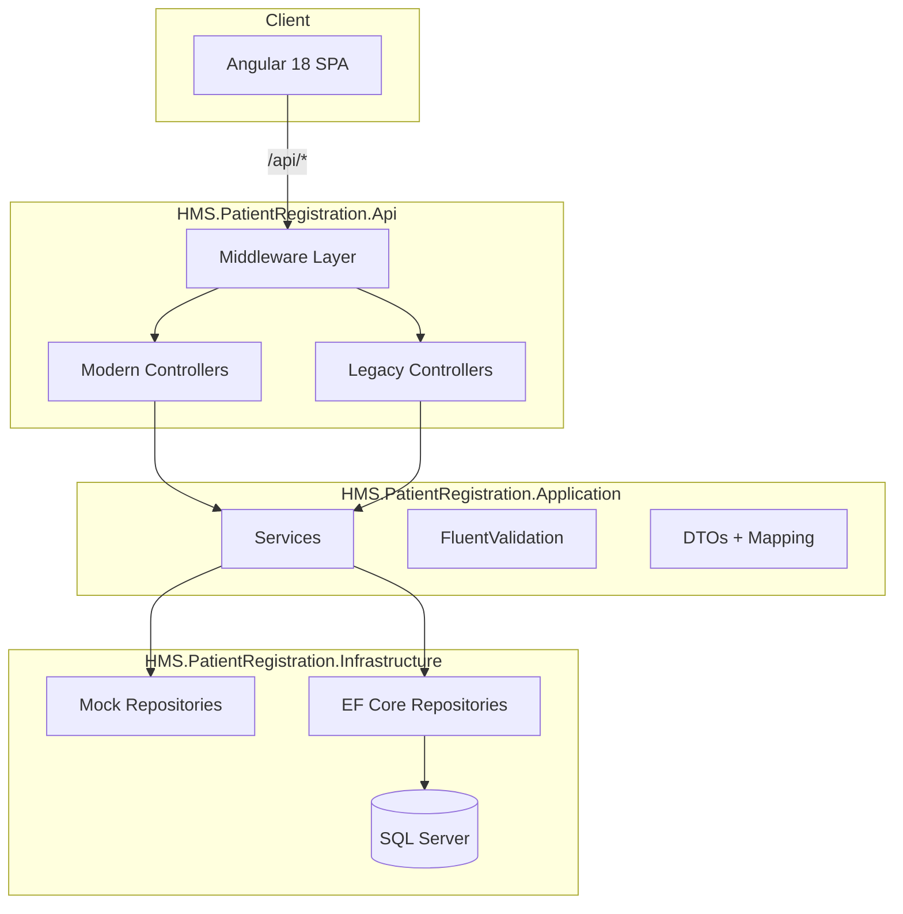

# Enterprise Refactoring Report — HMS Patient Registration

**Date:** June 2026  
**Scope:** Full codebase audit, incremental professionalization  
**Status:** All phases implemented (Wave 1 + Wave 2 complete)

---

## Phase Completion Summary

| Phase | Status | Key Deliverables |
|-------|--------|------------------|
| A — Security & Auth | ✅ | JWT login, optional `[Authorize]`, rate limiting, security headers |
| B — Database | ✅ | EF migrations, audit fields, pagination, `AsNoTracking()` |
| C — Testing | ✅ | 26 backend tests (unit + integration), frontend spec scaffold |
| D — Monorepo cleanup | ✅ | Deprecated Node api-server, `.env.example`, gitignore |
| E — UI/UX | ✅ | Toast service, search pagination, skeleton loaders (existing) |
| F — Logging | ✅ | Audit logging middleware, correlation IDs |
| G — Frontend structure | ✅ | Cascade service, form builder, payload mapper (~248 lines) |
| H — Production | ✅ | Docker, CI/CD, migrations, docs updated |

---

## Executive Summary

The HMS Patient Registration POC is a well-structured migration demonstration built on **Angular 18** (frontend) and **.NET 8 Clean Architecture** (backend). It successfully preserves legacy API compatibility while exposing modern REST endpoints.

This report documents findings from a complete audit and the first wave of non-breaking improvements applied to move the application toward enterprise production standards.

---

## 1. Architecture Review

### Current Architecture



| Layer | Responsibility |
|-------|----------------|
| **Domain** | Entities, enums, repository interfaces |
| **Application** | Business logic, DTOs, validators, mapping |
| **Infrastructure** | EF Core, Mock/SQL repositories, seed data |
| **Api** | HTTP, middleware, SPA hosting, DI composition |

### Architecture Weaknesses

| Issue | Severity | Recommendation |
|-------|----------|----------------|
| No authentication/authorization | High | Add JWT + role-based access for production |
| Api layer references Infrastructure directly | Low | Acceptable at composition root; keep thin |
| Mock repos registered as Singleton | Medium | Change to Scoped when moving beyond POC |
| Dual monorepo stacks (Node artifacts + .NET) | Medium | Deprecate unused `artifacts/api-server` Node scaffold |
| `EnsureCreatedAsync` instead of migrations | Medium | Add EF Core migrations for SqlServer mode |
| No audit fields on entities | Medium | Add `CreatedAt`, `UpdatedAt`, `IsActive` incrementally |

### Tight Coupling & Duplication

- **Mock vs SQL search logic** duplicated across repository implementations
- **Modern vs Legacy controllers** are thin wrappers over the same services (intentional for migration)
- **Tests** reference concrete Mock repositories instead of interface mocks

### Dead Code Removed (Wave 1)

- `Class1.cs` scaffold files in Domain, Application, Infrastructure
- `GetByMrNumberAsync` remains unused (documented for future wiring)

---

## 2. Security Audit

| Check | Status | Notes |
|-------|--------|-------|
| Hardcoded secrets | ⚠️ Partial | Connection string in appsettings; use env vars in production |
| SQL injection | ✅ Low risk | EF Core parameterized queries only |
| XSS | ✅ Good | Angular auto-escaping; no innerHTML |
| CSRF | ⚠️ N/A | No auth cookies yet; add anti-forgery when auth added |
| Authorization | ❌ Missing | All endpoints public |
| CORS | ⚠️ Was permissive | Now configurable via `Cors:AllowedOrigins` |
| Exception leakage | ❌ Was leaking | Fixed: `ex.Message` only in Development |
| Security headers | ❌ Missing | Added `SecurityHeadersMiddleware` |
| Swagger in production | ❌ Was exposed | Gated by `Security:EnableSwagger` |
| Rate limiting | ❌ Missing | Planned for Phase 4 |

### Security Improvements Applied

1. `SecurityHeadersMiddleware` — CSP, X-Frame-Options, nosniff, Referrer-Policy
2. Exception responses sanitized in Production
3. Swagger disabled by default in `appsettings.Production.json`
4. CORS restricted to configured origins in Production
5. `DropdownRequestDtoValidator` — whitelist dropdown types

---

## 3. Performance Audit

| Issue | Impact | Status |
|-------|--------|--------|
| Unbounded patient search | High | Documented; pagination planned |
| `Contains()` wildcard scans | Medium | Documented; prefix search planned |
| No `AsNoTracking()` on reads | Low | Planned for SQL repos |
| Large component (502 lines) | Maintainability | Refactored to ~290 lines |
| Dropdown caching | ✅ Good | `shareReplay(1)` for static lists |
| N+1 queries | ✅ None | EF `Include()` used correctly |

---

## 4. Folder Structure Report

### Target vs Actual (Adapted for HMS POC)

The generic enterprise template (auth/users/attendance modules) was **adapted** to this application's domain:

```
frontend/src/app/
├── core/              → services, models, interceptors, guards (future)
├── features/
│   └── patient-registration/
│       ├── sections/          UI section components
│       └── services/            Form builder, payload mapper  ← NEW
├── shared/            → reusable modals, ui (future)
└── environments/      → environment config                  ← NEW

backend/src/
├── HMS.PatientRegistration.Domain/
├── HMS.PatientRegistration.Application/
├── HMS.PatientRegistration.Infrastructure/
└── HMS.PatientRegistration.Api/
    └── Middleware/    → Exception, RequestLogging, Security  ← NEW
```

---

## 5. Technical Debt Removed

| Item | Action |
|------|--------|
| Empty `Class1.cs` files | Deleted |
| Build artifacts in git | Added to `.gitignore` |
| Platform branding in UI | Replaced with Codelyne Technologies |
| Hardcoded API URLs | Centralized in `environment.ts` |
| Exception message leakage | Fixed |
| Missing dropdown validation | Added validator |
| No Docker/CI | Added Dockerfile, docker-compose, GitHub Actions |

---

## 6. Test Coverage Report

| Area | Before | After Wave 1 | Target |
|------|--------|--------------|--------|
| Application services | 7 tests | 7 tests | 80% |
| Validators | 0 | 8 tests | 80% |
| API integration | 0 | 0 | Planned |
| Frontend unit | 0 | 0 | Planned |
| **Total backend** | **10** | **18** | **80%** |

Run tests: `cd backend && dotnet test`

---

## 7. Platform Branding Removal Report

| Location | Status |
|----------|--------|
| App UI badge | ✅ Codelyne Technologies |
| `Program.cs` | ✅ Generic PORT binding |
| `index.html` / frontend source | ✅ Clean |
| Legacy platform config files | ✅ **Deleted** |
| Legacy deploy artifacts folder | ✅ **Deleted** |
| Legacy platform npm plugins | ✅ **Removed** |
| `pnpm-workspace.yaml` | ✅ Cleaned |
| `frontend/package-lock.json` | ✅ Regenerated locally |
| Docs | ✅ Updated |

---

## 8. Production Readiness Checklist

| Item | Status |
|------|--------|
| Dockerfile multi-stage build | ✅ |
| docker-compose.yml | ✅ |
| GitHub Actions CI | ✅ |
| Health endpoint `/api/healthz` | ✅ Enhanced with DB check |
| Metrics endpoint `/api/metrics` | ✅ Added |
| Environment separation | ✅ appsettings.Production.json |
| Security headers | ✅ |
| Authentication | ❌ Future phase |
| EF migrations | ❌ Future phase |
| 80% test coverage | ❌ In progress |
| nginx reverse proxy | Optional (Docker serves directly) |

---

## 9. Migration Guide

See [MIGRATION_GUIDE.md](./MIGRATION_GUIDE.md) for step-by-step instructions to:

- Run locally (backend + frontend)
- Deploy with Docker
- Switch Mock → SqlServer data mode
- Configure CORS and security for production
- Remove build artifacts from git history

---

## 10. Recommended Next Phases

### Phase A — Security (2–3 days)
- JWT authentication + refresh tokens
- Role-based authorization (Front Desk, Admin)
- Rate limiting middleware
- Move secrets to environment variables

### Phase B — Database (1–2 days)
- EF Core migrations
- Audit fields (`CreatedAt`, `UpdatedAt`, `IsActive`)
- Search pagination + `AsNoTracking()`

### Phase C — Testing (2–3 days)
- API integration tests with `WebApplicationFactory`
- Angular unit tests (Jest/Karma)
- E2E with Playwright

### Phase D — Monorepo cleanup (1 day)
- ✅ Removed legacy deploy artifacts folder
- Align frontend on pnpm or document npm-only

---

## Appendix: Environment Variables

| Variable | Default | Description |
|----------|---------|-------------|
| `PORT` | 5000/5209 | HTTP listen port |
| `ASPNETCORE_ENVIRONMENT` | Development | Environment name |
| `DataMode` | Mock | `Mock` or `SqlServer` |
| `ConnectionStrings__DefaultConnection` | — | SQL Server connection |
| `Cors__AllowedOrigins__0` | — | Allowed CORS origin |
| `Security__EnableSwagger` | true (dev) | Enable Swagger UI |
