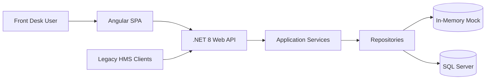
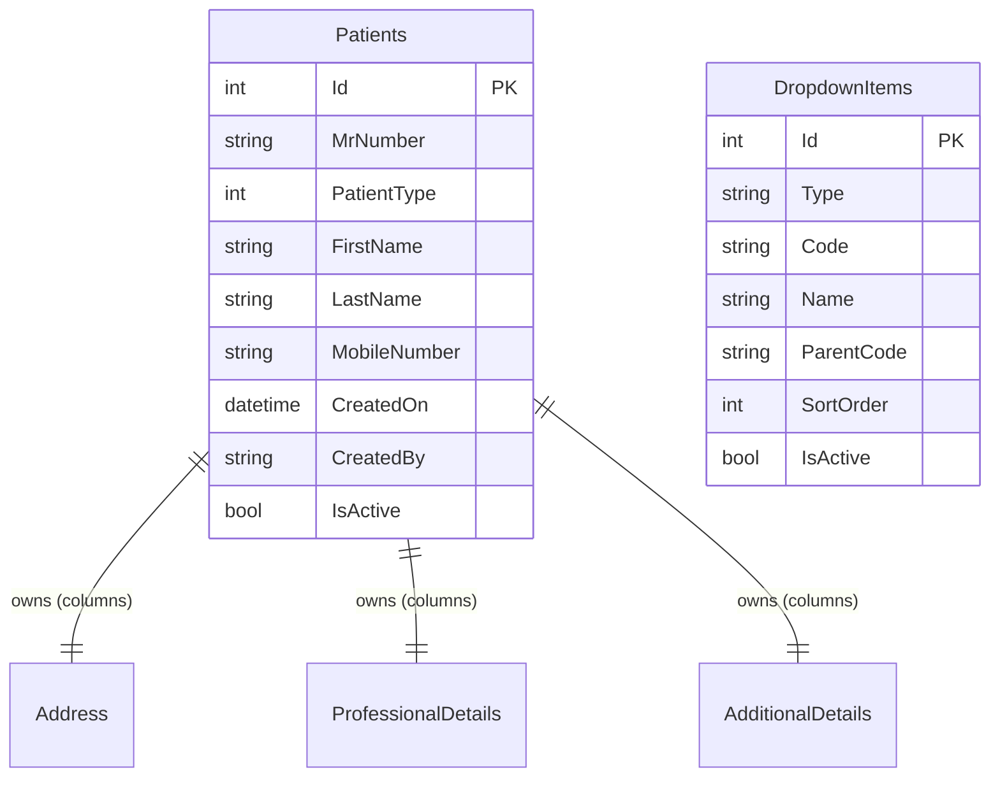

# HMS Patient Registration — Technical Architecture & Engineering Documentation

**Product:** Hospital Management System — Patient Registration Module  
**Organization:** Codelyne Technologies  
**Classification:** Internal / Engineering

---

## 1. Document Control

| Field | Value |
|-------|-------|
| **Document Version** | 1.0.0 |
| **Release Date** | 2026-06-19 |
| **Status** | Approved for POC / Production pilot |

### Revision History

| Version | Date | Author | Summary |
|---------|------|--------|---------|
| 1.0.0 | 2026-06-19 | Codelyne Engineering | Initial enterprise architecture documentation |

### Author Information

| Role | Responsibility |
|------|----------------|
| Solution Architect | Architecture, layering, migration strategy |
| Backend Lead | .NET API, EF Core, security |
| Frontend Lead | Angular SPA, forms, UX |
| DevOps | Docker, CI/CD, deployment |

### Reviewers

| Role | Focus |
|------|-------|
| Technical Reviewer | Architecture correctness |
| Security Reviewer | Auth, headers, validation |
| QA Lead | Test strategy alignment |

### Approval Matrix

| Role | Approval |
|------|----------|
| Engineering Lead | ✅ |
| Product Owner | ✅ (POC scope) |
| Security | ✅ (POC baseline) |

---

## 2. Executive Summary

### Purpose

The HMS Patient Registration application is a **migration proof-of-concept** that modernizes a legacy hospital patient registration module onto:

- **Angular 18** (standalone components, reactive forms)
- **.NET 8 Web API** (Clean / Onion Architecture)
- **SQL Server or in-memory Mock** data modes

Business goals:

- Register and update patient demographic, address, and professional details
- Search existing patients and load records for editing
- Support **phased migration** via dual legacy + modern REST APIs
- Demonstrate enterprise-grade patterns (security, audit, pagination, CI/CD)

Technical objectives:

- Single deployable unit (SPA + API on one origin)
- Configurable authentication (optional during migration)
- Repository pattern with swappable Mock/SQL implementations
- Automated build and test pipeline

### Scope

#### Included Modules

| Module | Status |
|--------|--------|
| Patient Registration | ✅ Implemented |
| Master Data / Dropdowns | ✅ Implemented |
| Patient Search | ✅ Implemented (paginated) |
| Authentication (JWT) | ✅ Implemented (optional) |
| Health & Metrics | ✅ Implemented |
| Legacy API compatibility | ✅ Implemented |

#### Excluded Modules (Out of POC Scope)

| Module | Notes |
|--------|-------|
| User Management (CRUD) | Config-based demo users only |
| Dashboard | Not in scope |
| Attendance | Not in scope |
| Reports / Analytics | Not in scope |
| Notifications (push/email) | Not in scope |
| Settings UI | Configuration via appsettings / env vars |
| Billing / Insurance workflows | Placeholder UI section only |
| Integrations (HL7, FHIR) | Future |

#### Assumptions

- Single hospital / single tenant for POC
- Front-desk operators use browser-based registration terminal
- SQL Server available when `DataMode=SqlServer`; otherwise Mock mode suffices
- HTTPS termination handled by reverse proxy in production

#### Dependencies

| Dependency | Purpose |
|------------|---------|
| .NET 8 SDK | Backend runtime |
| Node.js 20+ | Angular build |
| SQL Server (optional) | Persistent storage |
| Docker (optional) | Container deployment |
| GitHub Actions | CI pipeline |

---

## 3. Solution Overview

### System Overview

A **modular monolith**: one .NET process serves the compiled Angular SPA at `/` and the REST API at `/api`. The backend follows Clean Architecture with four layers (Domain → Application → Infrastructure → API).



### Key Features

| Feature | Implementation |
|---------|----------------|
| **Authentication** | JWT Bearer; login at `POST /api/auth/login`; optional enforcement |
| **User Management** | Config-defined users (`frontdesk`, `admin`) — not a full IAM module |
| **Patient Registration** | Full reactive form with validation, cascades, save/update |
| **Patient Search** | Modal search with pagination |
| **Master Data** | Dropdown API with cascading geography |
| **Dashboard** | ❌ Not implemented |
| **Attendance** | ❌ Not implemented |
| **Reports** | ❌ Not implemented |
| **Notifications** | ❌ Not implemented |
| **Settings** | appsettings.json + environment variables |
| **Integrations** | Legacy HTTP endpoints for backward compatibility |

---

## 4. Technical Architecture

### Architecture Pattern

**Modular Monolith** with **Clean / Onion Architecture** on the backend.

- Not microservices (single deployable unit)
- Not event-driven (synchronous HTTP)
- Clear module boundaries enable future extraction if needed

### Architecture Principles

| Principle | Application |
|-----------|-------------|
| **Scalability** | Stateless API; horizontal scaling via container replicas |
| **Security** | JWT, rate limiting, security headers, input validation |
| **Maintainability** | Layered separation, FluentValidation, typed DTOs |
| **Extensibility** | Dual API (legacy + modern); repository abstraction |
| **Performance** | Lazy-loaded Angular routes; paginated search; `AsNoTracking()` reads |

---

## 5. High Level Architecture Diagram

```
┌─────────────────────────────────────────────────────────────────┐
│                        Client Layer                              │
│  Browser (Angular 18 SPA)  │  Legacy HTTP Clients              │
└────────────────────────────┬────────────────────────────────────┘
                             │ HTTPS
                             ▼
┌─────────────────────────────────────────────────────────────────┐
│                     Presentation Layer                           │
│  Static Files (wwwroot)  │  ASP.NET Core Controllers            │
│  SPA Fallback (index.html) │  Middleware Pipeline               │
└────────────────────────────┬────────────────────────────────────┘
                             │
                             ▼
┌─────────────────────────────────────────────────────────────────┐
│                     Application Layer                            │
│  PatientRegistrationService │ DropdownService │ AuthService      │
│  FluentValidation │ DTO Mapping │ PagedResult                    │
└────────────────────────────┬────────────────────────────────────┘
                             │
                             ▼
┌─────────────────────────────────────────────────────────────────┐
│                     Domain Layer                                 │
│  Patient Entity │ DropdownItem │ Repository Interfaces           │
└────────────────────────────┬────────────────────────────────────┘
                             │
                             ▼
┌─────────────────────────────────────────────────────────────────┐
│                     Infrastructure Layer                         │
│  Mock Repositories │ EF Core Repositories │ JWT Token Generator  │
│  DbContext │ Migrations │ Seed Data                              │
└────────────────────────────┬────────────────────────────────────┘
                             │
              ┌──────────────┴──────────────┐
              ▼                             ▼
     ┌─────────────────┐          ┌─────────────────┐
     │  In-Memory Mock  │          │   SQL Server     │
     │  (DataMode=Mock) │          │ (DataMode=Sql)   │
     └─────────────────┘          └─────────────────┘
```

### Layer Explanations

| Layer | Responsibility |
|-------|----------------|
| **Client** | Angular SPA for registration UI; legacy systems call HTTP JSON APIs |
| **Presentation (API)** | Routing, middleware, auth, static SPA hosting, Swagger |
| **Application** | Use cases, validation rules, DTO contracts, orchestration |
| **Domain** | Business entities, enums, repository interfaces — no framework deps |
| **Infrastructure** | EF Core, repositories, JWT, seed data, audit in DbContext |
| **Data** | Mock in-memory store or SQL Server via EF migrations |

---

## 6. Technology Stack

### Frontend

| Concern | Technology |
|---------|------------|
| Framework | Angular 18 (standalone components) |
| Language | TypeScript 5.5 (strict mode) |
| State Management | Reactive Forms + component-local state |
| Routing | Angular Router (lazy-loaded feature) |
| UI | Custom HMS design system (`styles.scss`) |
| Forms | `@angular/forms` Reactive Forms |
| Validation | Custom validators + mirror server rules |
| HTTP | `HttpClient` + functional interceptors |

### Backend

| Concern | Technology |
|---------|------------|
| Runtime | .NET 8 |
| Framework | ASP.NET Core Web API |
| ORM | Entity Framework Core 8 |
| Validation | FluentValidation |
| Authentication | JWT Bearer (`Microsoft.AspNetCore.Authentication.JwtBearer`) |
| API Docs | Swashbuckle (Swagger UI at `/api/swagger`) |

### Database

| Concern | Technology |
|---------|------------|
| Primary DB | SQL Server (production) |
| Dev / Demo | In-memory Mock repositories |
| Caching | Session-level dropdown cache (`shareReplay`) in Angular |
| Search Engine | SQL `LIKE` via EF `Contains()` — full-text search is future work |

### DevOps

| Concern | Technology |
|---------|------------|
| Containerization | Docker multi-stage build |
| Orchestration | docker-compose |
| CI/CD | GitHub Actions (`.github/workflows/ci.yml`) |
| Monitoring | `/api/healthz`, `/api/metrics` |
| Logging | ASP.NET Core ILogger + structured audit middleware |

---

## 7. Frontend Architecture

### Folder Structure

```
frontend/src/
├── environments/           # API base URL, branding constants
├── app/
│   ├── app.component.ts    # Shell header + router-outlet
│   ├── app.config.ts       # DI: HTTP, interceptors, router
│   ├── app.routes.ts       # Lazy route definitions
│   ├── core/
│   │   ├── interceptors/   # auth.interceptor, error.interceptor
│   │   ├── models/         # DTOs, ApiResponse, enums
│   │   └── services/       # patient, dropdown, auth (HTTP layer)
│   ├── features/
│   │   └── patient-registration/
│   │       ├── sections/   # Presentational form sections
│   │       ├── services/   # Form builder, payload mapper, cascades
│   │       └── *.component # Container: orchestration + UI state
│   └── shared/
│       ├── components/     # Patient search modal
│       └── services/       # ToastService
└── styles.scss             # Global design tokens
```

| Folder | Purpose |
|--------|---------|
| `core/` | Singleton services, models, cross-cutting HTTP concerns |
| `features/` | Business feature modules (one per domain area) |
| `shared/` | Reusable UI not tied to a single feature |
| `environments/` | Build-time configuration |

### Routing Architecture

| Route | Type | Component |
|-------|------|-----------|
| `/` | Public (default) | PatientRegistrationComponent (lazy) |
| `/**` | Redirect | → `/` |

**Protected routes:** Not yet implemented at router level. API auth is enforced server-side when `Security:RequireAuth=true`.

**Role-based routes:** Future — roles exist in JWT (`FrontDesk`, `Admin`) but UI routing is not role-gated yet.

### State Management Architecture

| State Type | Mechanism |
|------------|-----------|
| **Global** | None (no NgRx). Auth token in `localStorage` |
| **Local** | Component fields: `saving`, `loadingMaster`, toast messages |
| **Form** | Single `FormGroup` tree in container component |
| **Server** | RxJS Observables via services; dropdown cache in `DropdownService` |

### Component Architecture

| Tier | Examples |
|------|----------|
| **Container** | `PatientRegistrationComponent` — form, save, load, master data |
| **Presentational sections** | `PersonalDetailsComponent`, `ResidentialAddressComponent`, … |
| **Shared** | `PatientSearchModalComponent` |
| **Services (logic)** | `PatientFormBuilderService`, `PatientPayloadMapper`, `PatientCascadeService` |

### UI Design System

| Token | Value |
|-------|-------|
| Primary | `--hms-primary` (clinical teal) |
| Typography | Inter (Google Fonts) |
| Layout | Sticky header, max-width content area (1180px) |
| Responsive | Mobile hides secondary header meta; form stacks on narrow viewports |
| Feedback | Inline toasts, skeleton loaders during master data fetch |

---

## 8. Backend Architecture

### Folder Structure

```
backend/src/
├── HMS.PatientRegistration.Domain/
│   ├── Common/              # IAuditableEntity, PagedResult
│   ├── Entities/            # Patient, DropdownItem, owned types
│   ├── Enums/               # Gender, PatientType
│   └── Interfaces/          # Repository contracts
├── HMS.PatientRegistration.Application/
│   ├── Common/              # ApiResponseDto, AgeCalculator, PasswordHasher
│   ├── DTOs/                # Request/response shapes
│   ├── Interfaces/          # Service + ICurrentUserService
│   ├── Mapping/             # Entity ↔ DTO mapping
│   ├── Services/            # Use case implementations
│   └── Validators/          # FluentValidation rules
├── HMS.PatientRegistration.Infrastructure/
│   ├── Auth/                # JWT generator, CurrentUserService
│   ├── Data/                # SeedData
│   ├── Persistence/         # DbContext, migrations, initializer
│   └── Repositories/        # Mock/ and Sql/ implementations
└── HMS.PatientRegistration.Api/
    ├── Authorization/       # OptionalAuthRequirementHandler
    ├── Controllers/         # Modern + Legacy controllers
    ├── Middleware/          # Security, rate limit, audit, exception, logging
    └── wwwroot/             # Compiled Angular SPA
```

### Layered Architecture

| Layer | Classes | Responsibility |
|-------|---------|----------------|
| **Controller** | `PatientsController`, `AuthController`, Legacy controllers | HTTP mapping, status codes |
| **Service** | `PatientRegistrationService`, `DropdownService`, `AuthService` | Business orchestration |
| **Repository** | `SqlPatientRegistrationRepository`, `MockPatientRegistrationRepository` | Persistence |
| **Database** | `PatientRegistrationDbContext`, EF migrations | Schema, audit on save |

### Request Lifecycle

```
HTTP Request
  → SecurityHeadersMiddleware
  → RateLimitingMiddleware
  → ExceptionHandlingMiddleware (try/catch wrapper)
  → RequestLoggingMiddleware (timing + correlation ID)
  → Authentication (JWT validation if token present)
  → Authorization ([Authorize] + OptionalAuth handler)
  → AuditLoggingMiddleware (post: logs mutating requests)
  → Controller Action
  → FluentValidation (automatic)
  → Application Service
  → Repository
  → DbContext / Mock Store
  → ApiResponseDto JSON response
```

---

## 9. Database Design

### Database Overview

- **Engine:** SQL Server 2019+ (via EF Core)
- **Mode switch:** `DataMode=Mock` bypasses database entirely
- **Schema management:** EF Core migrations (`InitialCreate`)
- **Soft delete:** `IsActive` flag with global query filter

### Entity Relationship Diagram



Owned types (`Address`, `ProfessionalDetails`, `AdditionalDetails`) are stored as columns on the `Patients` table (EF Core owned entities).

### Table: Patients

| Column | Type | Purpose |
|--------|------|---------|
| Id | int (PK, identity) | Surrogate key |
| MrNumber | nvarchar(50) | Medical record number (auto-generated) |
| PatientType | int | Enum: New, Existing, Staff, Newborn |
| FirstName, LastName | nvarchar(100) | Required name fields |
| Gender | int | Enum |
| DateOfBirth | datetime2 | Optional DOB |
| AgeYears/Months/Days | int | Computed or entered age |
| MobileNumber | nvarchar(20) | Required contact |
| Email | nvarchar(150) | Optional |
| CivilId | nvarchar(50) | Government ID |
| Address_* | various | Owned address fields |
| ProfessionalDetails_* | various | Occupation, company, etc. |
| AdditionalDetails_* | various | Nationality, alerts, etc. |
| CreatedOn | datetime2 | Audit timestamp |
| ModifiedOn | datetime2 | Last update |
| CreatedBy | nvarchar(100) | Audit user |
| ModifiedBy | nvarchar(100) | Audit user |
| IsActive | bit | Soft delete flag |

**Indexes:** `IX_Patients_MrNumber`  
**Constraints:** PK on Id; required FirstName, LastName, MobileNumber

### Table: DropdownItems

| Column | Type | Purpose |
|--------|------|---------|
| Id | int (PK) | Surrogate key |
| Type | nvarchar(50) | Category (Country, State, BloodGroup, …) |
| Code | nvarchar(50) | Value code |
| Name | nvarchar(150) | Display label |
| ParentCode | nvarchar(50) | Cascade parent (e.g. State → Country) |
| SortOrder | int | Display order |
| IsActive | bit | Soft delete |

**Indexes:** `IX_DropdownItems_Type_ParentCode`

---

## 10. Authentication & Authorization

### Login Flow

```
Client → POST /api/auth/login { username, password }
       → AuthService validates against Auth:Users config
       → JwtTokenGenerator creates signed JWT
       → Returns { accessToken, tokenType, expiresInSeconds, role }
Client → Stores token (localStorage)
       → Sends Authorization: Bearer <token> on subsequent requests
```

### JWT Architecture

| Claim | Value |
|-------|-------|
| sub / name | Username |
| role | `FrontDesk` or `Admin` |
| iss | `Jwt:Issuer` |
| aud | `Jwt:Audience` |
| exp | Configurable (`Jwt:ExpiryMinutes`) |

### Refresh Token Flow

**Not implemented.** Tokens expire after configured minutes; client must re-login. Refresh tokens are a roadmap item.

### Session Management

Stateless JWT — no server-side session store.

### RBAC

| Role | Permissions |
|------|-------------|
| **FrontDesk** | Patient CRUD, search, dropdowns |
| **Admin** | Same as FrontDesk (POC — extend for admin-only ops later) |

**Access matrix:**

| Endpoint | Anonymous (RequireAuth=false) | FrontDesk | Admin |
|----------|--------------------------------|-----------|-------|
| POST /api/auth/login | ✅ | ✅ | ✅ |
| GET /api/healthz | ✅ | ✅ | ✅ |
| POST /api/patients | ✅* | ✅ | ✅ |
| POST /api/patients/search | ✅* | ✅ | ✅ |

*When `Security:RequireAuth=true`, anonymous access is denied.

---

## 11. API Documentation

See also: [API_DOCUMENTATION.md](./API_DOCUMENTATION.md)

### API Standards

**Request format:** JSON body for POST; query params for GET dropdowns  
**Response format:** Unified envelope:

```json
{
  "success": true,
  "message": "optional human message",
  "data": { },
  "errors": []
}
```

**Error handling:** Validation → 400 with `errors[]`; not found → 404; unhandled → 500 (sanitized in production)  
**Validation:** FluentValidation + Angular reactive validators

### Endpoint Summary

| Method | URL | Description | Auth |
|--------|-----|-------------|------|
| POST | `/api/auth/login` | Obtain JWT | Public |
| POST | `/api/patients` | Create/update patient | FrontDesk, Admin |
| GET | `/api/patients/{id}` | Get patient by ID | FrontDesk, Admin |
| POST | `/api/patients/search` | Paginated search | FrontDesk, Admin |
| GET | `/api/dropdowns/{type}` | Master data | Public |
| GET | `/api/healthz` | Health check | Public |
| GET | `/api/metrics` | Runtime metrics | Public |
| POST | `/api/patientregistration/IUD` | Legacy save | FrontDesk, Admin |
| POST | `/api/patientregistration/Fetch` | Legacy search (flat list) | FrontDesk, Admin |
| POST | `/api/patientregistration/FetchPatientData` | Legacy get by ID | FrontDesk, Admin |
| POST | `/api/CommonDropdown/Fetch` | Legacy dropdowns | Public |

---

## 12. Module-Wise Technical Documentation

### Patient Registration Module

**Architecture:** Container component + section components + payload mapper service  
**Workflow:** Load master data → fill form → validate → POST save → receive MR number  
**Database:** `Patients` table (+ owned columns)  
**APIs:** `POST /api/patients`, legacy `IUD`

### Patient Search Module

**Architecture:** Shared modal component  
**Workflow:** Enter criteria → paginated search → select row → load full patient  
**Database:** Query on `Patients` with filters  
**APIs:** `POST /api/patients/search` (paged), legacy `Fetch` (unpaged)

### Master Data / Dropdown Module

**Architecture:** `DropdownService` with session cache for static lists  
**Workflow:** GET by type; cascade via `parentCode` for State/City/Area  
**Database:** `DropdownItems`  
**APIs:** `GET /api/dropdowns/{type}`, legacy `CommonDropdown/Fetch`

### Authentication Module

**Architecture:** Config-based users + JWT generator  
**Workflow:** Login → token → optional Bearer on API calls  
**Database:** None (users in appsettings)  
**APIs:** `POST /api/auth/login`

### Modules Not Implemented

Dashboard, User Management CRUD, Attendance, Reports, Notifications — documented as future phases in [MIGRATION_STRATEGY.md](./MIGRATION_STRATEGY.md).

---

## 13. Security Architecture

### Security Layers

| Layer | Implementation |
|-------|----------------|
| Authentication | JWT Bearer |
| Authorization | Role-based `[Authorize]` + optional bypass |
| Encryption | HTTPS (production); passwords hashed (SHA-256 config store) |
| Input Validation | FluentValidation + Angular validators + dropdown whitelist |
| Audit Logs | `AuditLoggingMiddleware` for mutating HTTP methods |
| Rate Limiting | In-memory per-IP (120 req/min default) |
| Security Headers | CSP, X-Frame-Options, nosniff, Referrer-Policy |

### Vulnerability Protection

| Threat | Mitigation |
|--------|------------|
| SQL Injection | EF Core parameterized queries |
| XSS | Angular auto-escaping; no innerHTML |
| CSRF | JWT in header (not cookie-based) — low CSRF risk |
| SSRF | No outbound URL fetching from user input |
| Brute Force | Rate limiting; login returns generic 401 |

---

## 14. Performance Architecture

### Frontend Optimization

- Lazy-loaded feature route (~19 KB lazy chunk)
- Production build hashing and tree shaking
- Dropdown caching via `shareReplay(1)`

### Backend Optimization

- `AsNoTracking()` on read queries
- Paginated search (`Skip`/`Take`)
- Singleton mock repos for demo mode

### Database Optimization

- Index on `MrNumber`, composite on `DropdownItems (Type, ParentCode)`
- Soft-delete query filters

### Caching Strategy

| Data | Cache |
|------|-------|
| Static dropdowns | Angular session cache |
| Patient records | No cache (always fresh from API) |

### Lazy Loading / Code Splitting

Angular lazy route for patient registration feature module.

---

## 15. Logging & Monitoring

| Log Type | Implementation |
|----------|----------------|
| Application logs | `ILogger` — Information/Warning levels |
| Request logs | `RequestLoggingMiddleware` — method, path, status, ms |
| Audit logs | `AuditLoggingMiddleware` — POST/PUT/PATCH/DELETE |
| Error logs | `ExceptionHandlingMiddleware` — full exception server-side |

| Monitoring | Endpoint |
|------------|----------|
| Health | `GET /api/healthz` (+ DB check in SqlServer mode) |
| Metrics | `GET /api/metrics` — uptime, environment, data mode |
| Alerting | External (configure with Prometheus/Grafana — not in POC) |

---

## 16. DevOps & Deployment

### Environments

| Environment | Configuration |
|-------------|---------------|
| Development | `ASPNETCORE_ENVIRONMENT=Development`, Mock data, Swagger on |
| Staging | Production settings + SqlServer |
| Production | Swagger off, RequireAuth on, restricted CORS |

### CI/CD Pipeline

```
Push/PR → GitHub Actions
  ├── backend: dotnet restore → build → test (26 tests)
  └── frontend: npm ci → ng build
```

### Docker Architecture

Multi-stage Dockerfile:

1. Build Angular → `dist/hms-frontend`
2. Publish .NET API
3. Copy SPA into `wwwroot`
4. Runtime: `mcr.microsoft.com/dotnet/aspnet:8.0` on port 8080

See [MIGRATION_GUIDE.md](./MIGRATION_GUIDE.md) for commands.

---

## 17. Configuration Management

### Environment Variables

See [.env.example](../.env.example) and [Appendix A](#appendix-a-configuration-reference).

### Secrets Management

- JWT key, SQL connection strings via environment variables in production
- Never commit secrets to source control
- `appsettings.Production.json` disables Swagger, restricts hosts

### Feature Flags

| Setting | Purpose |
|---------|---------|
| `Security:RequireAuth` | Enforce JWT on protected endpoints |
| `Security:EnableSwagger` | Toggle API docs |
| `DataMode` | Mock vs SqlServer |

---

## 18. Testing Strategy

| Type | Coverage |
|------|----------|
| **Unit tests** | Services, validators, age calculator (26 tests) |
| **Integration tests** | API via `WebApplicationFactory` — health, login, search |
| **E2E tests** | Not yet automated (manual browser testing) |
| **Coverage target** | 80% — roadmap (current ~40% estimated) |

Run: `cd backend && dotnet test`

---

## 19. Coding Standards

### Frontend

- Standalone components only (no NgModules)
- Container/presentational split
- Services for HTTP and form logic
- Strict TypeScript

### Backend

- Clean Architecture dependency rule
- Async/await throughout
- DTOs at API boundary — never expose entities directly

### Naming Conventions

| Element | Convention |
|---------|------------|
| C# classes | PascalCase |
| C# variables | camelCase |
| Angular components | PascalCase class, kebab-case selector |
| Folders | kebab-case |
| Constants | UPPER_CASE or PascalCase static |

### Git Standards

- `main` branch protected via CI
- Conventional commit messages recommended
- PR requires passing CI

---

## 20. Disaster Recovery & Backup

| Concern | Strategy |
|---------|----------|
| **Backup** | SQL Server automated backups (operational responsibility) |
| **Recovery** | Restore DB + redeploy container from image |
| **Data retention** | Hospital policy — not defined in POC |
| **Mock mode** | No persistence — data lost on restart |

---

## 21. Scalability Roadmap

### Current Architecture

Single modular monolith — suitable for single hospital POC.

### Future Architecture

| Phase | Change |
|-------|--------|
| Phase 1 | Extract auth to dedicated IdP (Azure AD / Keycloak) |
| Phase 2 | Add read replicas for search-heavy workloads |
| Phase 3 | Extract reporting to separate service |
| Phase 4 | Event-driven patient sync (HL7/FHIR) |

### Scaling Strategy

- Horizontal: multiple API container instances behind load balancer
- Database: SQL Server scaling + connection pooling
- CDN: static assets if SPA served separately

---

## 22. Production Readiness Checklist

| Area | Status |
|------|--------|
| Security headers | ✅ |
| JWT auth (optional) | ✅ |
| Rate limiting | ✅ |
| Input validation | ✅ |
| EF migrations | ✅ |
| Docker | ✅ |
| CI pipeline | ✅ |
| Health checks | ✅ |
| Audit logging | ✅ |
| 80% test coverage | ⚠️ In progress |
| Refresh tokens | ❌ Future |
| Login UI | ❌ Future |
| E2E automation | ❌ Future |

---

## 23. Appendix

### Glossary

| Term | Definition |
|------|------------|
| MR Number | Medical Record Number assigned to a patient |
| POC | Proof of Concept |
| SPA | Single Page Application |
| RBAC | Role-Based Access Control |

### Abbreviations

| Abbrev | Meaning |
|--------|---------|
| HMS | Hospital Management System |
| API | Application Programming Interface |
| JWT | JSON Web Token |
| EF | Entity Framework |
| DTO | Data Transfer Object |

### References

- [ARCHITECTURE.md](./ARCHITECTURE.md)
- [API_DOCUMENTATION.md](./API_DOCUMENTATION.md)
- [MIGRATION_STRATEGY.md](./MIGRATION_STRATEGY.md)
- [MIGRATION_GUIDE.md](./MIGRATION_GUIDE.md)
- [ENTERPRISE_REFACTORING_REPORT.md](./ENTERPRISE_REFACTORING_REPORT.md)

### Architecture Decisions

| ID | Decision | Rationale |
|----|----------|-----------|
| ADR-001 | Modular monolith over microservices | POC scope; simpler deploy |
| ADR-002 | Dual legacy + modern API | Phased migration without breaking callers |
| ADR-003 | Mock/SqlServer switch | Demo without DB; production with SQL |
| ADR-004 | Optional JWT auth | Backward compatibility during rollout |
| ADR-005 | Owned EF types for address | Matches legacy single-table patient model |

### Appendix A: Configuration Reference

| Key | Default | Description |
|-----|---------|-------------|
| `DataMode` | Mock | Mock or SqlServer |
| `Security:RequireAuth` | false | Enforce JWT |
| `Security:EnableSwagger` | true (dev) | API docs |
| `Jwt:Key` | (dev key) | Signing secret |
| `ConnectionStrings:DefaultConnection` | localhost | SQL Server |

---

*End of document*
